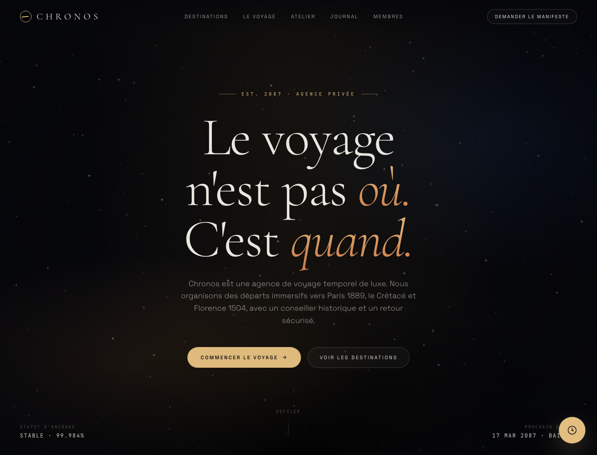
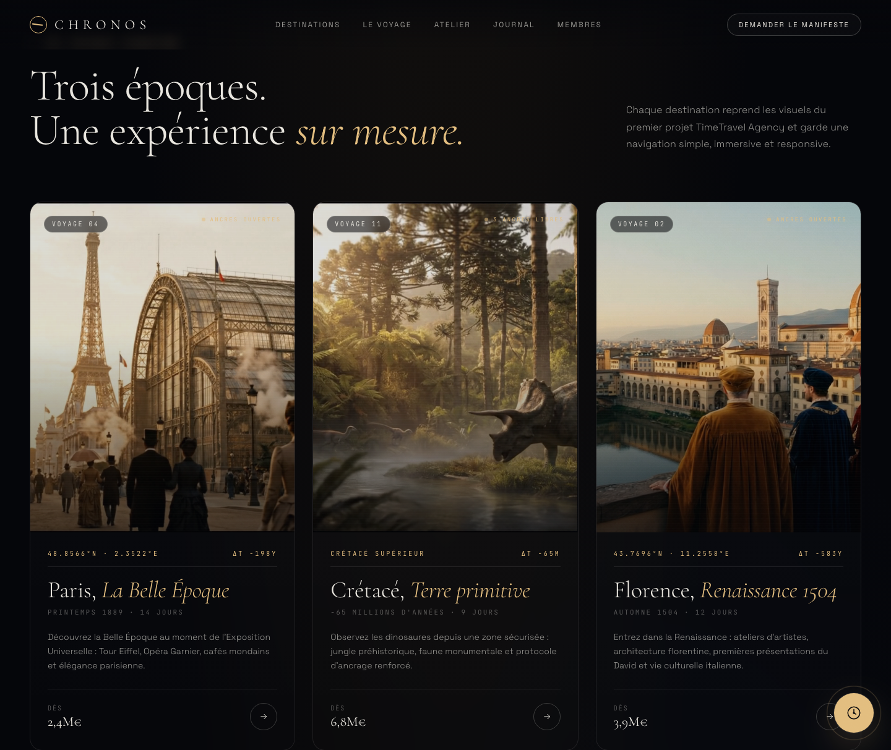
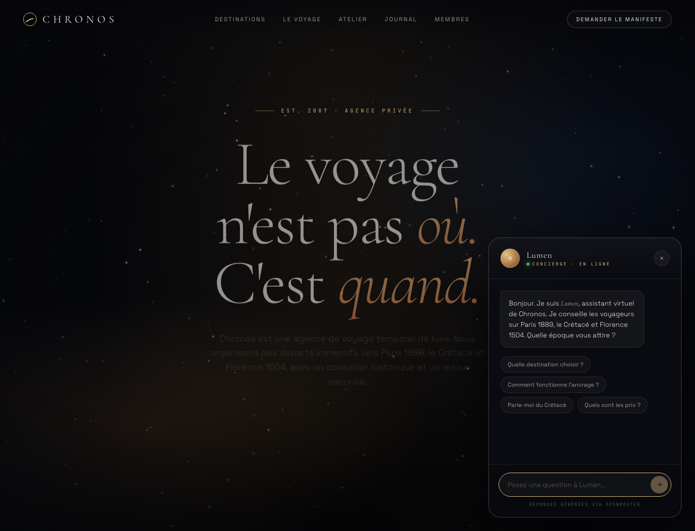
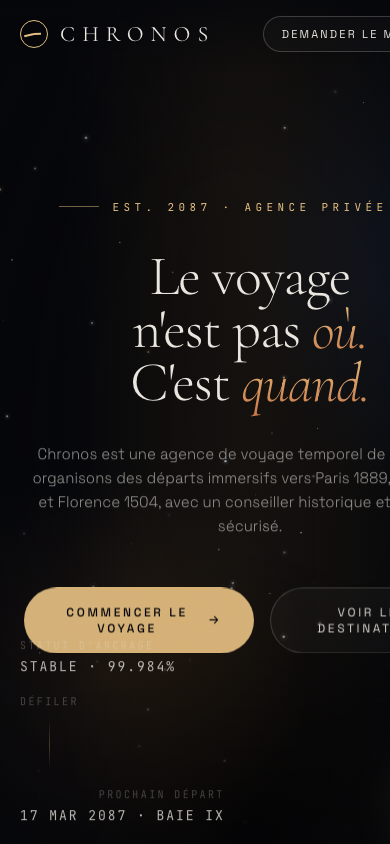

# Rapport - Chronos TimeTravel Agency

## Informations generales

- Projet : Chronos - TimeTravel Agency
- Mission : webapp moderne, immersive et interactive pour une agence de voyage temporel.
- Destinations : Paris 1889, Cretace, Florence 1504.
- Groupe : EN COURS - ajouter les 4 noms et prenoms.
- URL publique : EN COURS - a completer apres deploiement.
- Repository GitHub : EN COURS - a completer apres push.

## Stack technique

- Frontend : HTML, CSS, JavaScript.
- UI : single-page app responsive, dark mode, glassmorphism.
- Animation : Canvas 2D, CSS transitions, IntersectionObserver.
- Chatbot : React 18 CDN + backend `/api/chat`.
- IA : OpenRouter via `OPENROUTER_API_KEY`.
- Serveur local : Node.js sans dependance externe.
- Assets : videos et images locales du dossier `img/`.

## Preuves visuelles

- Accueil desktop : `docs/screenshots/01-home-desktop.png`
- Destinations desktop : `docs/screenshots/02-destinations-desktop.png`
- Chatbot ouvert : `docs/screenshots/03-chatbot-open.png`
- Vue mobile : `docs/screenshots/04-mobile-home.png`






## Exercice 1.1 - Definition des features

Statut : REALISE.

Fonctionnalites definies :

- Page d'accueil immersive avec hero anime.
- Presentation premium de l'agence Chronos.
- Galerie de 3 destinations temporelles.
- Cards interactives avec videos locales.
- Agent conversationnel IA.
- Recommandation personnalisee.
- Formulaire de reservation avec validation locale.
- Footer avec contacts et navigation.

Choix effectue :

- Priorite donnee a une webapp simple, lisible, presentable et rapide.
- Le formulaire complet avec paiement ou base de donnees n'a pas ete ajoute : EN COURS si le projet doit devenir production.

## Exercice 1.2 - Maquette rapide

Statut : REALISE.

Outil utilise :

- Claude Design.

Prompt de depart :

```text
Luxury time travel agency landing page in dark mode with cinematic video hero,
premium futuristic UI, elegant animations, 3 immersive destination cards,
floating AI chatbot, glassmorphism effects, and ultra-luxury Apple x Interstellar aesthetic.
```

Structure retenue :

- Header.
- Hero.
- Destinations.
- Parcours voyage.
- Personnalisation / reservation.
- Chatbot flottant.
- Footer.

Responsive :

- Desktop : cards en 3 colonnes.
- Mobile : cards en colonne, navigation simplifiee, chatbot adapte a la largeur.

## Exercice 2.1 - Setup et generation initiale

Statut : REALISE.

Outil utilise :

- Claude Code pour generer le premier rendu HTML.

Fichiers produits :

- `Chronos.html` : page principale.
- `index.html` : redirection utile pour deploiement statique.
- `server.mjs` : serveur local.
- `package.json` : scripts de lancement.

Tests realises :

- Ouverture Chrome headless desktop.
- Ouverture Chrome headless mobile.
- Verification DOM des sections principales.
- Verification des assets references dans le HTML.

## Exercice 2.2 - Integration des assets du premier projet

Statut : REALISE.

Assets integres :

- Paris 1889 : `img/Paris_Eiffel_Tower_Video.mp4`.
- Cretace : `img/Prehistoric_Triceratops_Cinematic_Video.mp4`.
- Florence 1504 : video Florence Gen-4 dans `img/`.

Implementation :

- Les videos sont integrees dans les cards destinations.
- Attributs utilises : `autoplay`, `muted`, `loop`, `playsinline`, `preload="metadata"`.
- Objectif : rendu immersif sans interaction obligatoire.

Point de vigilance :

- Le dossier `img/` doit etre pousse sur GitHub/deploiement, sinon les videos ne fonctionneront pas en ligne.

## Exercice 2.3 - Ajout d'animations

Statut : REALISE.

Animations ajoutees :

- Fond etoile anime en Canvas.
- Apparition progressive du hero.
- Reveal au scroll avec `IntersectionObserver`.
- Hover sur les cards destinations.
- Micro-interactions sur boutons et chatbot.

Choix performance :

- Pas de librairie lourde type GSAP.
- Animations natives CSS/JS pour limiter le poids.

## Exercice 3.1 - Agent conversationnel

Statut : REALISE cote code, EN COURS cote cle API.

Implementation :

- Widget flottant en bas a droite.
- Interface chat avec React 18 CDN.
- Appel reel vers `/api/chat`.
- Backend Node/Vercel qui appelle OpenRouter.
- Aucun moteur de reponses simule n'est utilise.

Fichiers :

- `api/chat.js` : endpoint compatible Vercel.
- `server.mjs` : endpoint local `/api/chat`.
- `lib/openrouter-chat.js` : prompt systeme + appel OpenRouter.
- `.env.example` : variables a configurer.

Personnalite de l'agent :

- Nom : Lumen.
- Role : assistant virtuel de Chronos.
- Ton : professionnel, chaleureux, expert en histoire.
- Connaissances : Paris 1889, Cretace, Florence 1504, prix, durees, securite.

Configuration restante :

- Ajouter une vraie cle `OPENROUTER_API_KEY` dans `.env`.
- En production, ajouter cette variable dans Vercel/Netlify.

Sources techniques :

- Documentation OpenRouter Chat Completions : https://openrouter.ai/docs/api-reference/chat-completion
- Reference OpenRouter : https://openrouter.ai/docs/api-reference/overview

## Exercice 3.2 - Automatisation et personnalisation

Statut : REALISE.

Fonctionnalites ajoutees :

- Quiz de recommandation.
- Questions sur experience, periode, activite.
- Calcul local des scores destination.
- Resultat personnalise : Paris 1889, Cretace ou Florence 1504.

Reservation :

- Formulaire avec destination, date, nombre de voyageurs.
- Validation automatique cote client.
- Message d'erreur si champ manquant ou nombre invalide.
- Message de confirmation si la demande est coherente.

Limite :

- Pas d'envoi email ni base de donnees : EN COURS si besoin de reservation reelle.

## Exercice 4.1 - Documentation et code

Statut : REALISE.

Documentation produite :

- `README.md` : lancement rapide, etat, livrables.
- `RAPPORT.md` : detail exercice par exercice.
- `.env.example` : configuration IA.

Transparence IA :

- Maquette : Claude Design.
- Code initial : Claude Code.
- Chatbot : OpenRouter.
- Assets : ancien projet TimeTravel Agency.

## Exercice 4.2 - Deploiement

Statut : EN COURS.

Ce qui est pret :

- `index.html` pour ouvrir le site facilement.
- `api/chat.js` pour deploiement Vercel.
- `package.json` pour serveur Node.
- Variables d'environnement documentees.

Ce qu'il reste a faire :

- Creer le repo GitHub ou pousser les fichiers.
- Ajouter `OPENROUTER_API_KEY` dans les variables de production.
- Deployer sur Vercel, Netlify ou Render.
- Tester l'URL publique sur desktop et mobile.
- Ajouter l'URL finale dans ce rapport.

## Instructions de lancement local

```bash
cd /Users/arthurcapo/Desktop/TravelAgency
cp .env.example .env
npm start
```

Puis ouvrir :

```text
http://localhost:3000
```

Sans cle OpenRouter :

- L'interface fonctionne.
- Le chatbot affiche que la configuration IA est en cours.

Avec cle OpenRouter :

- Le chatbot genere des reponses via OpenRouter.

## Checklist finale Moodle

- URL publique : EN COURS.
- Repository GitHub : EN COURS.
- README : REALISE.
- Rapport : REALISE.
- Captures : REALISE.
- Noms/prenoms des membres : EN COURS.
- Depot individuel par chaque membre : EN COURS.
